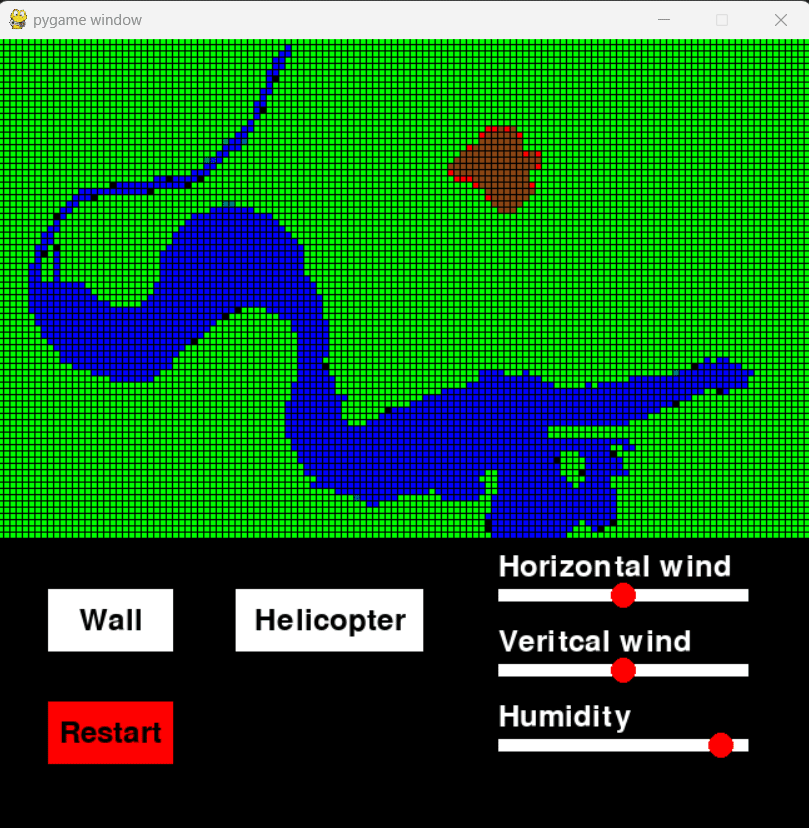

Forest fire simulation using cellular automata. Fire spreads depending on the type of wind and humidity used. However, it cannot pass through water. It can be extinguished using a wall and firefighting foam dropped from a helicopter.

